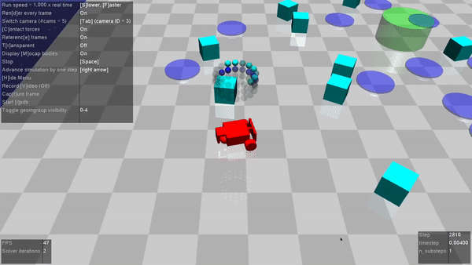
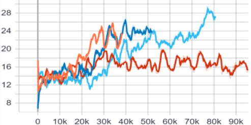
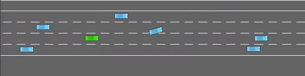
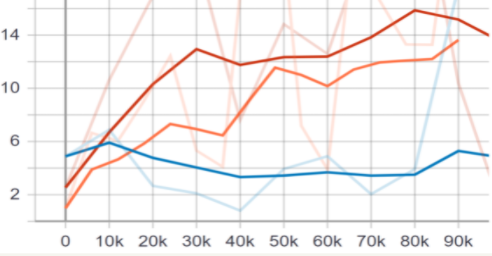
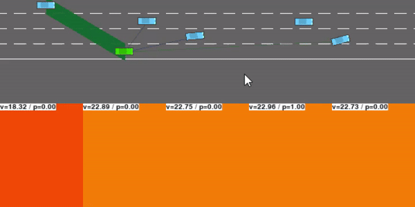
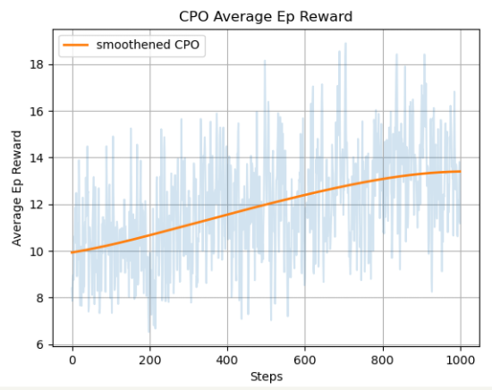

# SafetyRL_HighwayEnv

Benchmarking Safety Started RL Agents.

```
configurations-
Epochs: 160
Goal: Reaching the green circle, avoiding all hazards
Agent: Car
```

### PPO



### CPO


## Moving to Higway Environment

Applying Constrained Policy Networks on [Highway Environment](https://github.com/eleurent/highway-env).


---

## Table of Contents

- [DQN](#dqn)
- [PPO](#ppo)
- [CPO](#cpo)
- [Contributors](#contributors)

---

## DQN


```
Config-
Gamma: 0.70
Epsilon: 0.1
N_steps: 20k
```

Average Episode Rewards for Dqn



| Colour | Gamma | Exploration Factor | Max Ep Reward |
| :----: | :---: | :----------------: | :-----------: |
| Orange | 0.80  |        0.5         |     25.8      |
| Indigo | 0.90  |        0.5         |     27.1      |
|  Red   | 0.99  |        0.9         |     19.8      |
|  Blue  | 0.70  |        0.9         |     29.6      |

## PPO



```
Config-
Gamma: 0.99
Epsilon: 0.2
N_steps: 20000
```

Average Episode Rewards for PPO



| Colour | Gamma | Max Ep Reward |
| :----: | :---: | :-----------: |
| Orange | 0.85  |     18.2      |
|  Blue  | 0.70  |     16.8      |
|  Red   | 0.90  |     19.4      |

## CPO



```
Config-
'discount_factor':0.8,
'hidden1':256,
'hidden2':256,
'v_lr':1e-3,
'cost_v_lr':1e-3,
'value_epochs':80,
'cost_value_epochs':80,
'num_conjugate':10,
'max_decay_num':10,
'line_decay':0.8,
'max_kl':0.01,
'max_avg_cost':800/1000,
'damping_coeff':0.01,
'gae_coeff':0.97,
```



---

## How To Run

DQN:

`cd scripts`

`python ./experiments.py evaluate ./configs/HighwayEnv/env_test.json ./configs/HighwayEnv/agents/DQNAgent/ego_attention.json --test --recover-from ./out/HighwayEnv/DQNAgent/saved_models/latest.tar`

CPO:

`cd SafeRL-CPO`

More intructions inside the folder.

## Contributors

[Varun Jain](https://github.com/varunjain3)\
[Harsh Patel](https://github.com/harshp1802)\
[Shivam Sahni](https://github.com/shivam15s)\
[Pushkar Mujumdar](https://github.com/pmujumdar27)

---

## References

1. https://github.com/eleurent/highway-env
2. https://arxiv.org/abs/1705.10528
3. https://github.com/openai/safety-starter-agents
4. https://github.com/eleurent/rl-agents
5. https://github.com/sergeivolodin/SafeContinuousStateRL
